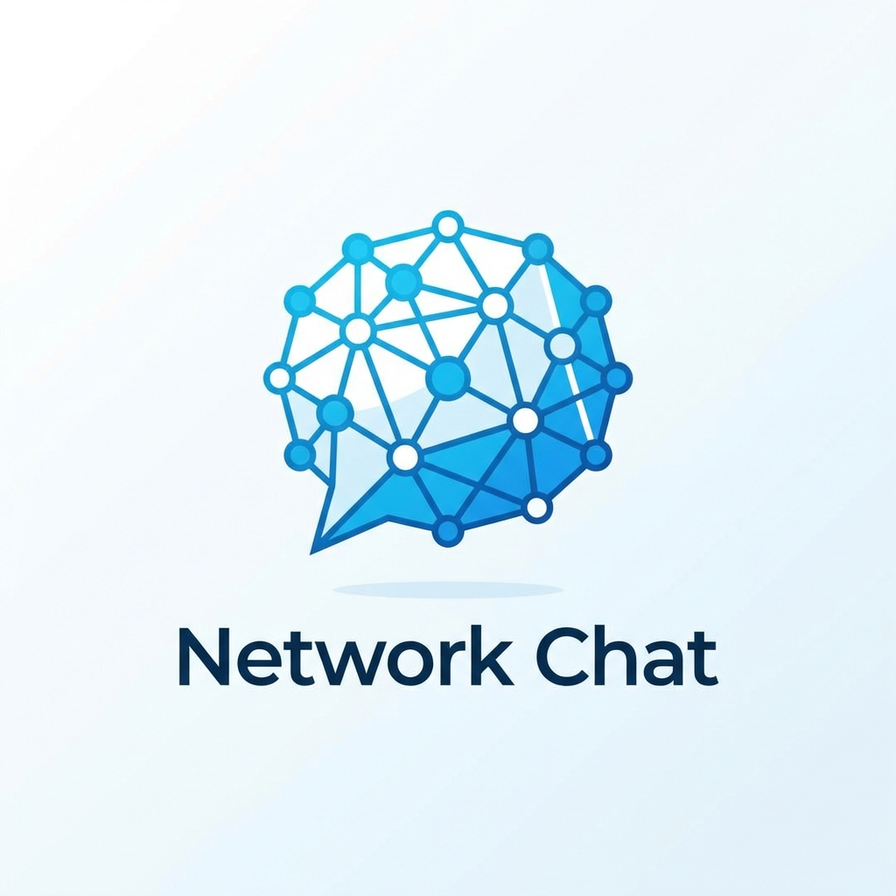
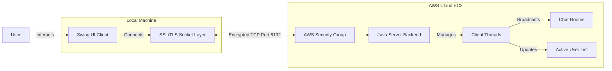
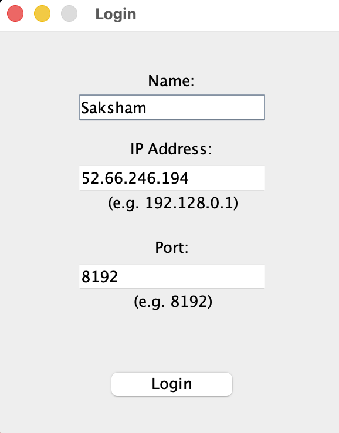
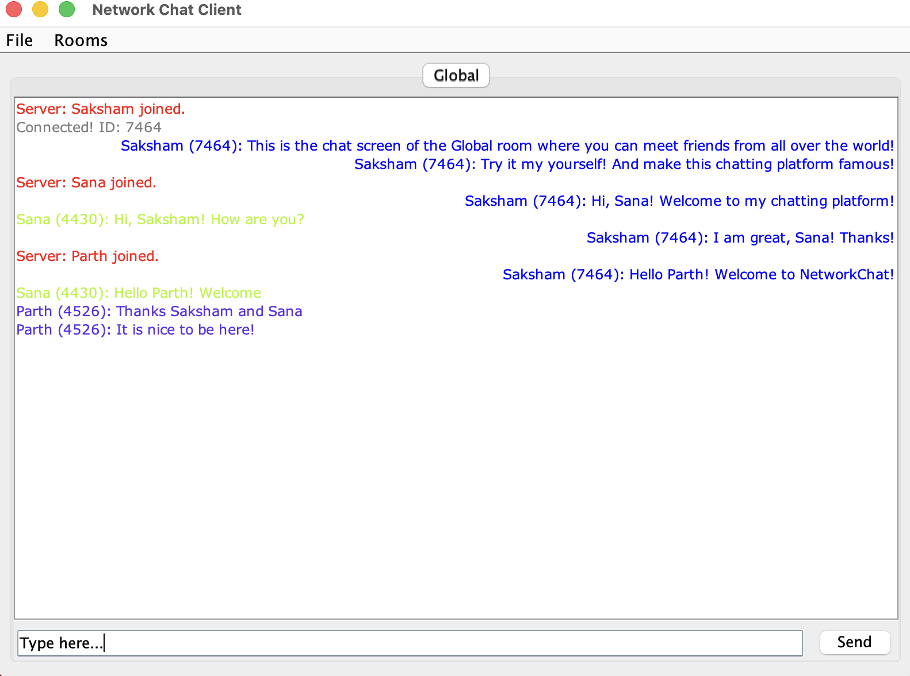

# Network Chat

<div align="center">
  
  <br>
  
  [](https://github.com/am-saksham/NetworkChat)
  [](LICENSE)
  [](https://jdk.java.net/21/)
  [](https://github.com/am-saksham/NetworkChat/releases)

  **Secure, Real-time, Room-based Messaging Application**
  <br>
  *Built with Java Swing, SSL/TLS, and TCP Sockets.*
</div>

---

## 🚀 Overview

**NetworkChat** is a robust, enterprise-grade chat application designed for secure communication. Unlike standard chat apps, NetworkChat uses a custom TCP protocol over SSL/TLS to ensure that every message is encrypted and delivered reliably. It features a modern Swing-based UI with support for multiple chat rooms, direct user invites, and persistent connections.

The backend is deployed on **AWS EC2**, providing 24/7 availability, while the client is packaged as a native executable for easy distribution.

## ✨ Key Features

- **🔒 End-to-End Security**:
  - Full **SSL/TLS encryption** for all data transmission.
  - Custom Keystore/Truststore management with self-signed certificate handling.
- **💬 Real-time Messaging**:
  - Instant message delivery using persistent TCP sockets.
  - "Trust All" certificate logic for seamless connectivity across varied network environments (e.g., University WiFi).
- **🏘️ Room Management**:
  - **Global Chat**: Public lobby for all users.
  - **Private Rooms**: Create password-protected rooms.
  - **Invitations**: Send direct invites to online users (bypasses password requirement).
- **👥 User Experience**:
  - **Live User List**: See who is online in real-time.
  - **Rich UI**: Color-coded usernames, tabbed interface for multiple rooms, and system notifications.
  - **Auto-Login**: Pre-configured connection details for instant access.
- **⚙️ Robust Backend**:
  - Handles client disconnects, timeouts, and "zombie" connections gracefully.
  - Multi-threaded architecture supporting concurrent users.

## 🛠️ Technology Stack

| Component | Technology | Description |
|-----------|------------|-------------|
| **Language** | Java 21 | Core logic and networking |
| **GUI** | Java Swing | Native desktop interface |
| **Networking** | TCP Sockets | Reliable, ordered data stream |
| **Security** | SSL/TLS (JSSE) | Encrypted transport layer |
| **Hosting** | AWS EC2 | Amazon Linux 2023 server instance |
| **Build** | GitHub Actions | CI/CD for .exe and .dmg generation |

## 🏗️ System Architecture



The application follows a standard **Client-Server** architecture secured via SSL/TLS:
1.  **Client**: Initiates a TCP connection to `52.66.246.194:8192`.
2.  **Handshake**: Server establishes a secure SSL tunnel.
3.  **Authentication**: User sends hashed credentials (optional) or guest login.
4.  **Session**: A persistent `Socket` is maintained for real-time bi-directional communication.

## 📸 Screenshots

| Login Screen | Chat Interface |
|:---:|:---:|
|  |  |

*(Note: Screenshots to be added. Run the app to see the live UI!)*

## 📦 Installation

### Download Binaries
Go to the [Releases](https://github.com/am-saksham/NetworkChat/releases) page to download the installer for your OS:
- **Windows**: `NetworkChat-Setup.exe`
- **macOS**: `NetworkChat.dmg`

### Quick Start (Source)
If you prefer running from source:

1.  **Clone the Repository**
    ```bash
    git clone https://github.com/am-saksham/NetworkChat.git
    cd NetworkChat
    ```

2.  **Run Client**
    ```bash
    ./run_client.sh
    ```

## 🌐 Server Deployment

The server is currently hosted and live at `52.66.246.194:8192`.
To host your own instance:

1.  **Generate Keys**:
    ```bash
    ./keygen.sh
    ```
2.  **Compile & Run**:
    ```bash
    ./run_server.sh
    ```
    *Ensure Port 8192 is open in your firewall.*

---

<div align="center">
  <sub>Built with ❤️ by Saksham</sub>
</div>
