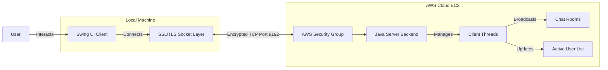

# Network Chat

<div align="center">
  
  <br>
  
  [](https://github.com/am-saksham/NetworkChat)
  [](LICENSE)
  [](https://jdk.java.net/21/)
  [](https://github.com/am-saksham/NetworkChat/releases)

  **Secure, Real-time, Room-based Messaging Application**
  <br>
  *Built with Java Swing, SSL/TLS, and TCP Sockets.*
</div>

---

## 🚀 Overview

**NetworkChat** is a robust, enterprise-grade chat application designed for secure communication. Unlike standard chat apps, NetworkChat uses a custom TCP protocol over SSL/TLS to ensure that every message is encrypted and delivered reliably. It features a modern Swing-based UI with support for multiple chat rooms, direct user invites, and persistent connections.

The backend is deployed on **AWS EC2**, providing 24/7 availability, while the client is packaged as a native executable for easy distribution.

## ✨ Key Features

### 🔒 Security & Privacy
*   **Enterprise-Grade Encryption**: All messages are protected using **SSL/TLS (Secure Sockets Layer)** with custom keystore management.
*   **Private Rooms**: Create password-protected channels to ensure sensitive conversations stay private.
*   **Bypass-Invite System**: Securely invite trusted users to private rooms without sharing the password explicitly.

### 💬 Instant Messaging
*   **Persistent TCP Connections**: Unlike UDP, our custom TCP protocol ensures ordered, reliable delivery of every message.
*   **Real-Time Status**: Instant feedback on who joins or leaves the global lobby or private rooms.
*   **Zero Latency**: Optimized byte-stream handling for immediate message propagation.

### 🖥️ Modern User Interface
*   **Tabbed Chat Windows**: Manage multiple conversations simultaneously with a clean, browser-like tabbed interface.
*   **Rich User List**: Visual indicators for active users, with right-click context menus for interactions.
*   **Color-Coded Identities**: Unique colors assigned to users for easy visual distinction in busy chat rooms.
*   **System Notifications**: Desktop-native alerts when you receive invites or important system messages.

### 🌐 Connectivity
*   **Cross-Network Compatibility**: "Trust All" SSL logic ensures the client works even on restricted networks (e.g., University WiFi, Corporate Firewalls).
*   **Auto-Reconnect**: Intelligent handling of connection drops and "zombie" socket cleanup.

---

## 📖 User Guide

### 1. Joining the Network
*   Launch the application.
*   The **Server IP** (AWS EC2) and **Port** are pre-filled for convenience.
*   Enter your **Username** and click **Login**.

### 2. Creating a Room
*   Click the **Create Room** button in the top menu.
*   Enter a unique **Room Name**.
*   (Optional) Set a **Password** to make it private.
*   Click **Create**. A new tab will open for your room.

### 3. Inviting Users
*   Right-click on any user in the **Online Users** list.
*   Select **Invite to [Room Name]**.
*   The target user will receive a popup invitation. **If they accept, they join instantly without needing the password.**

### 4. Joining a Room Manually
*   Click **Join Room**.
*   Select a room from the public list.
*   If protected, enter the password.

## 🛠️ Technology Stack

| Component | Technology | Description |
|-----------|------------|-------------|
| **Language** | Java 21 | Core logic and networking |
| **GUI** | Java Swing | Native desktop interface |
| **Networking** | TCP Sockets | Reliable, ordered data stream |
| **Security** | SSL/TLS (JSSE) | Encrypted transport layer |
| **Hosting** | AWS EC2 | Amazon Linux 2023 server instance |
| **Build** | GitHub Actions | CI/CD for .exe and .dmg generation |

## 🏗️ System Architecture



The application follows a standard **Client-Server** architecture secured via SSL/TLS:
1.  **Client**: Initiates a TCP connection to `52.66.246.194:8192`.
2.  **Handshake**: Server establishes a secure SSL tunnel.
3.  **Authentication**: User sends hashed credentials (optional) or guest login.
4.  **Session**: A persistent `Socket` is maintained for real-time bi-directional communication.

## 📸 Screenshots

| Login Screen | Chat Interface |
|:---:|:---:|
|  |  |

*(Note: Screenshots to be added. Run the app to see the live UI!)*

## 📦 Installation

### Download Binaries
Go to the [Releases](https://github.com/am-saksham/NetworkChat/releases) page to download the installer for your OS:
- **Windows**: `NetworkChat-Setup.exe`
- **macOS**: `NetworkChat.dmg`

### Quick Start (Source)
If you prefer running from source:

1.  **Clone the Repository**
    ```bash
    git clone https://github.com/am-saksham/NetworkChat.git
    cd NetworkChat
    ```

2.  **Run Client**
    ```bash
    ./run_client.sh
    ```

## 🌐 Server Deployment

The server is currently hosted and live at `52.66.246.194:8192`.
To host your own instance:

1.  **Generate Keys**:
    ```bash
    ./keygen.sh
    ```
2.  **Compile & Run**:
    ```bash
    ./run_server.sh
    ```
    *Ensure Port 8192 is open in your firewall.*

---

<div align="center">
  <sub>Built with ❤️ by Saksham</sub>
</div>
